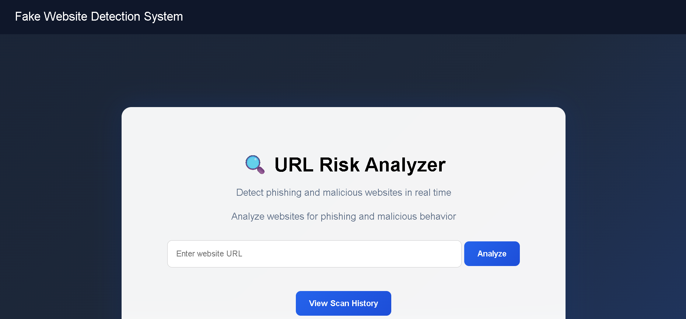
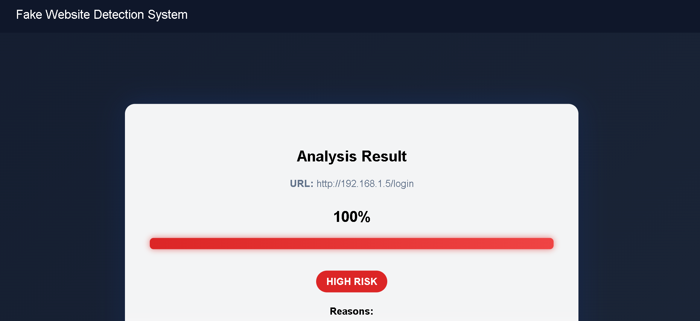
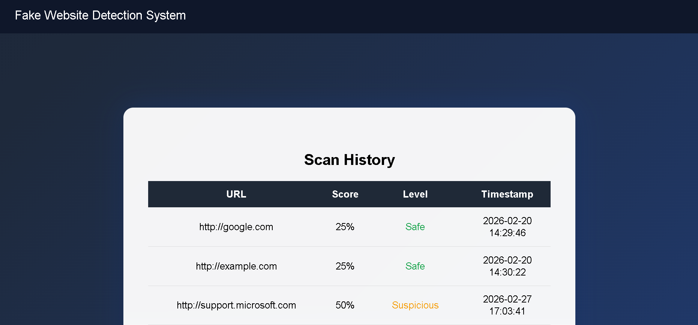

# 🔐 Fake Website Detection System

A rule-based cybersecurity web application that analyzes website URLs and identifies potential phishing and fake-website indicators using multi-factor heuristic analysis.

The system evaluates URL structure, domain characteristics, SSL certificate status, suspicious patterns, and other security indicators to generate an explainable risk score and classify the URL as **Safe, Suspicious, or High Risk**.

> **Note:** This project is designed for phishing and suspicious-URL detection. It is not a replacement for professional vulnerability scanners or comprehensive website security assessment tools.

---

## 🎯 Project Overview

Phishing websites are commonly designed to imitate legitimate websites and trick users into revealing sensitive information such as usernames, passwords, banking details, or other personal data.

The **Fake Website Detection System** provides a lightweight approach for identifying potentially suspicious websites before users interact with them.

Instead of relying on a single indicator, the system combines multiple URL-based and security-related parameters. Each detected indicator contributes to an overall risk score, making the final decision more explainable to the user.

---

## 🚀 Key Features

* 🔎 **URL Risk Analysis**

  * Analyzes submitted URLs using multiple security rules.

* 🔒 **HTTPS Detection**

  * Checks whether the website uses HTTPS.

* 🛡️ **SSL Certificate Validation**

  * Performs SSL certificate validation for HTTPS URLs.

* 🌐 **IP Address Detection**

  * Identifies URLs using an IP address instead of a conventional domain name.

* 📏 **Long URL Detection**

  * Detects unusually long URLs that may indicate suspicious behavior.

* 🌳 **Subdomain Analysis**

  * Identifies excessive subdomains that may be associated with deceptive URLs.

* ⚠️ **Suspicious Keyword Detection**

  * Checks for terms commonly found in phishing URLs, including:

    * `login`
    * `verify`
    * `update`
    * `secure`
    * `account`
    * `bank`

* 🔗 **Hyphen Abuse Detection**

  * Identifies domains containing multiple hyphens.

* 🎭 **Brand Impersonation Detection**

  * Checks domain names against a locally maintained list of brand names.

* 🌍 **Suspicious TLD Detection**

  * Checks the top-level domain against a locally maintained suspicious-TLD list.

* 🔗 **URL Shortener Detection**

  * Identifies commonly used URL-shortening services.

* 🔢 **Excessive Digit Detection**

  * Detects domains containing an unusually high number of digits.

* 🔁 **Repeated Character Detection**

  * Identifies repeated-character patterns in domain names.

* 📦 **Dangerous File Extension Detection**

  * Flags URLs ending with potentially dangerous file extensions such as `.exe`, `.zip`, `.scr`, and `.apk`.

* 📊 **Risk Scoring**

  * Combines detected indicators into a numerical risk score.

* 💡 **Explainable Results**

  * Displays the specific reasons contributing to the risk assessment.

* 🕒 **Scan History**

  * Stores recent URL analysis results with timestamps, scores, and classifications.

* 🖥️ **Web-Based Interface**

  * Provides a simple interface for submitting URLs and reviewing analysis results.

---

## 🧠 Detection Methodology

The system uses a **rule-based heuristic scoring model**.

Each security indicator has an associated weight. When a suspicious characteristic is detected, its corresponding weight is added to the risk score.

For example:

```text
HTTPS not used             → +25
Invalid SSL certificate    → +30
IP address used            → +30
Long URL                   → +20
Excessive subdomains       → +25
Suspicious keyword         → +20
Multiple hyphens           → +20
@ symbol                   → +30
Brand impersonation        → +25
Suspicious TLD             → +25
URL shortener              → +25
Excessive digits           → +15
Repeated characters        → +20
Dangerous file extension   → +40
```

The individual scores are combined to produce the final risk score.

The displayed score is capped at **100%** for presentation purposes.

---

## 📊 Risk Classification

The system converts the calculated score into a risk classification.

| Risk Score | Classification |
| ---------: | -------------- |
|      0–29% | 🟢 Safe        |
|     30–69% | 🟡 Suspicious  |
|    70–100% | 🔴 High Risk   |

The classification is intended as a heuristic assessment and should not be interpreted as a definitive statement that a website is malicious or safe.

---

## 🏗️ System Architecture

The project follows a modular architecture:

```text
                    ┌──────────────────┐
                    │      User        │
                    │  Enters Website  │
                    │       URL        │
                    └────────┬─────────┘
                             │
                             ▼
                    ┌──────────────────┐
                    │     Flask Web    │
                    │    Application   │
                    └────────┬─────────┘
                             │
                             ▼
                    ┌──────────────────┐
                    │    URL Parser    │
                    │   Domain / URL   │
                    │    Analysis      │
                    └────────┬─────────┘
                             │
                             ▼
                    ┌──────────────────┐
                    │    Rule Engine   │
                    │ Multiple Security│
                    │      Checks      │
                    └────────┬─────────┘
                             │
               ┌─────────────┴─────────────┐
               ▼                           ▼
      ┌─────────────────┐        ┌─────────────────┐
      │ Security Check  │        │  Risk Scoring   │
      │ SSL Validation  │        │ & Classification│
      └────────┬────────┘        └────────┬────────┘
               │                          │
               └────────────┬─────────────┘
                            ▼
                    ┌──────────────────┐
                    │  Result Display  │
                    │ Score + Level +  │
                    │      Reasons     │
                    └────────┬─────────┘
                             │
                             ▼
                    ┌──────────────────┐
                    │   Scan History   │
                    │   JSON Storage   │
                    └──────────────────┘
```

---

## 📁 Project Structure

```text
FakeWebsiteDetector/
│
├── app.py
│
├── modules/
│   ├── url_parser.py
│   ├── rule_engine.py
│   ├── security_check.py
│   └── scoring.py
│
├── data/
│   ├── brand_names.txt
│   └── suspicious_tlds.txt
│
├── templates/
│   ├── index.html
│   ├── result.html
│   └── history.html
│
├── screenshots/
│   ├── home.png
│   ├── result.png
│   └── history.png
│
├── requirements.txt
├── .gitignore
└── README.md
```

---

## 🛠️ Technologies Used

| Technology              | Purpose                                     |
| ----------------------- | ------------------------------------------- |
| **Python**              | Core programming language                   |
| **Flask**               | Web application framework                   |
| **HTML**                | Web interface structure                     |
| **CSS**                 | User interface styling                      |
| **JSON**                | Local scan-history storage                  |
| **urllib.parse**        | URL parsing                                 |
| **ssl**                 | SSL certificate validation                  |
| **socket**              | Network connection for certificate checking |
| **Regular Expressions** | Pattern-based URL analysis                  |

---

## ⚙️ How the System Works

### 1. URL Submission

The user enters a website URL through the web interface.

### 2. URL Normalization

The application checks the submitted URL and adds an HTTP scheme when no protocol is provided.

### 3. URL Parsing

The URL parser extracts relevant components such as:

* Scheme
* Domain
* Path

### 4. Security Analysis

The rule engine evaluates multiple characteristics of the URL.

### 5. Risk Calculation

Each detected indicator contributes a predefined number of points.

### 6. Classification

The final score is passed to the scoring module, which determines the corresponding risk level.

### 7. Result Generation

The application displays:

* Submitted URL
* Risk score
* Risk classification
* Detected indicators

### 8. History Storage

The scan result is stored locally so previously analyzed URLs can be reviewed.

---

## 🖥️ User Interface

### Home Page

The home page allows users to enter a URL and start an analysis.



### Analysis Result

The result page displays the calculated risk score, classification, and reasons identified by the rule engine.



### Scan History

The history page displays previously analyzed URLs together with their scores, classifications, and timestamps.



---

## 🧪 Testing

The system was tested using different categories of URLs, including:

### Legitimate Websites

Used to verify that commonly trusted websites are not unnecessarily flagged.

### Suspicious URLs

URLs containing characteristics such as suspicious keywords, unusual domain structures, or excessive hyphens were used to evaluate individual detection rules.

### Phishing-Like URLs

URLs designed to simulate common phishing patterns were used to verify whether multiple indicators contribute to a higher risk score.

### Security Testing

The project was also compared conceptually with security-testing tools such as OWASP ZAP.

The results are not expected to be identical because the two systems have different objectives. This project focuses primarily on **URL-based phishing and fake-website indicators**, whereas vulnerability scanners can perform deeper application-level security testing.

---

## 📈 Example Analysis

Example of a suspicious URL:

```text
http://secure-bank-login-update.com
```

Possible indicators:

```text
Website is not using HTTPS
Contains suspicious keyword: secure
Contains suspicious keyword: bank
Contains suspicious keyword: login
Contains suspicious keyword: update
Domain contains multiple hyphens
```

These indicators contribute to the overall risk score and can result in a **High Risk** classification.

---

## 🔐 Security and Ethical Considerations

This project is intended for:

* Educational purposes
* Cybersecurity learning
* Defensive security research
* Phishing-awareness demonstrations
* Safe URL analysis

The system does not attempt to exploit websites or gain unauthorized access to systems.

Users should avoid submitting private credentials, authentication tokens, or other sensitive information during testing.

---

## ⚠️ Limitations

The current system uses predefined rules and heuristic analysis. Therefore, it cannot guarantee that every malicious website will be detected.

A legitimate website may contain characteristics that appear suspicious, while a sophisticated phishing website may avoid the indicators used by the system.

The project does not perform:

* Full website vulnerability assessment
* Server-side vulnerability scanning
* Dynamic application security testing
* Malware execution analysis
* Comprehensive threat-intelligence correlation
* Machine-learning-based classification

The system should therefore be considered a **lightweight phishing and suspicious-URL detection tool**, not a complete website security scanner.

---

## 🚀 Future Improvements

Potential future development includes:

* Integration with threat-intelligence services
* Machine-learning-based URL classification
* Browser-extension integration
* Real-time domain reputation checking
* Expanded phishing-indicator datasets
* Automated model evaluation
* Improved URL and webpage-content analysis
* Integration with security monitoring platforms

---

## 🎓 Project Purpose

This project was developed as an academic cybersecurity project to gain practical experience in:

* Secure programming
* Web application development
* URL analysis
* Security heuristics
* Risk scoring
* SSL certificate validation
* Modular software design
* Cybersecurity testing
* Defensive security concepts

---

## 👨‍💻 Author

**Aditya Karmase**

B.Sc. Cyber and Digital Science

### Areas of Interest

* Cybersecurity
* SOC Operations
* Network Security
* Security Monitoring
* Threat Detection
* Python

---

## 📜 Disclaimer

This project is intended for educational and defensive cybersecurity purposes only.

A **Safe** result does not guarantee that a website is completely safe, and a **High Risk** result does not independently prove that a website is malicious. Users should use additional security controls and trusted security services when making security-sensitive decisions.

---

⭐ If you find this project useful, consider giving the repository a star.
